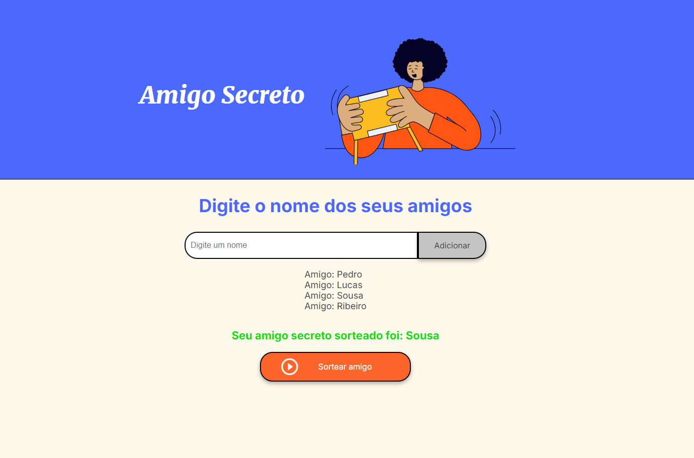

<h1 align="center">Projeto de Sorteador de Amigo Secreto 👫</h1> 

<h3>Este projeto foi desenvolvido a partir do projeto ONE da Oracle em parceria com a Alura 🌐</h3>
<h3>Review do projeto:📚</h3>

O projeto gira em torno de um sorteador de amigo secreto, onde você insere nome de pessoas que irão participar do sorteio, e ao clicar no botão <strong>Sortear amigo secreto</strong>, ele irá sortear alguém da lista automaticamente.

    

    

<h3>Funcionalidades do projeto: 🛠️</h3>
<ul>
  <li>Adicinar amigo: Verifica se o valor inserido no campo é valido e depois adiciona na lista os nomes</li>
  <li>Percorrer lista secreta: Adiciona na tela o nome das pessoas que foram inseridos na lista</li>
  <li>Sortear amigo: Verifica se a lista está vazia, ou possui valores válidos; Após é feita uma função que gera números aleatórios que dirão a respeito do índice de cada elemento no array, sorteia e mostra na tela o participante sorteado.</li>
</ul>

